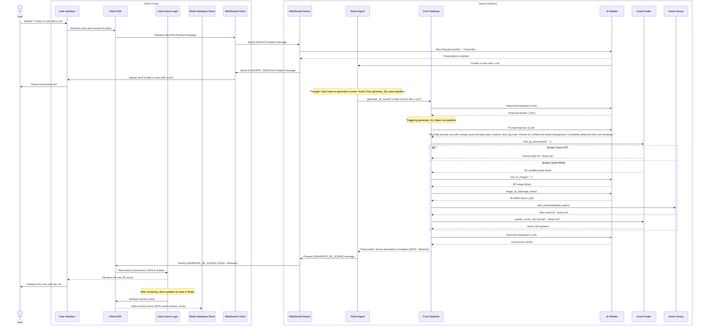

# Server (3D Scene Generation Platform)

## Overview

This document outlines the server-side component of a [3D Scene Generation Platform], a system designed to enable users to interactively create and modify 3D environments in virtual reality

The server is a Python-based application responsible for:
*   Managing persistent WebSocket connections with clients.
*   Receiving and interpreting requests for 3D scene generation/modification.
*   Orchestrating and dispatching tasks to various AI generation pipelines.
*   Structuring and transmitting responses back to the client.

We provide detailed instructions for the setup and operation of the server as well as its techincal overview.

---

<details>
<summary><strong>Table of Contents</strong> (click to expand)</summary>

- [Prerequisites](#prerequisites)
  - [Hardware](#hardware)
  - [Software](#software)
- [Installation](#installation)
  - [Method A: Automatic Installation](#method-a-automatic-installation)
  - [Method B: Manual Installation](#method-b-manual-installation)
- [Dependency Configuration](#dependency-configuration)
  - [1. Redis Server](#1-redis-server)
  - [2. Ollama](#2-ollama)
- [Environment Variables](#environment-variables)
- [Running the Server](#running-the-server)
- [Troubleshooting](#troubleshooting)
- [Technical Architecture](#technical-architecture)
  - [AI Model Components](#ai-model-components)
  - [Generative Pipelines](#generative-pipelines)
  - [Core Sub-Modules](#core-sub-modules)
  - [Agent](#agent)
  - [Asset Library](#asset-library)
  - [Asset Finder & Library Cache](#asset-finder--library-cache)
  - [Redis](#redis)
  - [Websocket](#websocket)
  - [Data Models & Serialization Protocol (SDK)](#data-models--serialization-protocol-sdk)
  - [General Workflow Illustration](#general-workflow-illustration)
  - [LLMs and AI models choice](#llms-and-ai-models-choice)

</details>

---

## Prerequisites

Before proceeding, ensure your system meets the following requirements.

### Hardware
*   **GPU:** A GPU with a minimum of **25 Gb** is required to run all AI pipelines simultaneously. You can lower comsumed memory by changing models in `config.json` file, but it might affect the performance.
*   **System:** A Linux-based operating system (Ubuntu 20.04+ is recommended).

### Software
*   **Git:** For cloning the repository.
*   **Conda / Miniconda:** For Python environment management.
*   **Sudo/root access:** Required for installing system-level dependencies.

## Installation

We provide an installation guide of all python dependencies.

---


1.  **Clone this Repository:**

2.  **Install the TRELLIS Library:**
    This project depends heavily on the `TRELLIS` image-to-3D library. You must first follow the official installation instructions from the Microsoft repository:
    
    **[https://github.com/microsoft/TRELLIS](https://github.com/microsoft/TRELLIS)**
    
    **Take note of the Conda environment you create during their setup process, as you will need to install this project's dependencies into that same environment.**

    If you have NVIDIA RTX 50-series GPU, you will have to build all PyTorch related libraries from source so that they are compatible with your PyTorch and CUDA versions. See [this GitHub issue](https://github.com/microsoft/TRELLIS/issues/243) for detailed explanation.
    
4.  **Install Project Dependencies:**
    After successfully installing TRELLIS, activate its Conda environment. Then, from the root of this project's directory (`Scener`), run the following command to install the remaining packages:
    ```bash
    pip install -e . -c constraints.txt
    ```
    *   `-e .`: Installs the project in "editable" mode.
    *   `-c constraints.txt`: Ensures that package versions adhere to the specified constraints, preventing conflicts.
  
    **IMPORTANT:** Make sure that you use 11.8 or 12.2 version of `CUDA Toolkit`, otherwise you will have incompatible `pytorch` builds.

---

## Dependency Configuration

After setting up the Python environment, you must install and configure Redis and Ollama.

### 1. Redis Server

Redis is an in-memory data structure store ([learn more](https://redis.io/)) utilized to store serialized scene JSON data.

**1.1. Install Redis**

```bash
sudo apt update
sudo apt install redis-server
```

**1.2. Configure Redis for Network Access**

You must edit the configuration file to allow the server to connect from non-local addresses.

```bash
sudo nano /etc/redis/redis.conf
```

Make the following two changes inside the file:
    
*   Find the line `bind 127.0.0.1 ::1` and change it to `bind 0.0.0.0`. This makes Redis listen on all available network interfaces.
*   Find the line `protected-mode yes` and change it to `protected-mode no`.

> **Note:** Disabling protected mode without a password is not recommended for production environments.

**1.3. Apply Changes and Enable Service**

Restart the Redis service to apply the new configuration and enable it to start on boot.

```bash
sudo systemctl restart redis-server
sudo systemctl enable redis-server
```

**1.4. Verify Redis is Running**

Check that Redis is listening on port `6379` for all interfaces. The expected output should contain `LISTEN` and `0.0.0.0:6379`.

```bash
sudo ss -tuln | grep 6379
```

### 2. Ollama

Ollama serves the Large Language Models (LLMs).

**2.1. Install Ollama**

```bash
curl -fsSL https://ollama.com/install.sh | sh
```

**2.2. Run the Ollama Service**

Run the following command to start the Ollama server.

```bash
ollama serve
```

**2.3. Pull Required LLM Models**

You must download the specific models required by the project, which are defined in `config.json` under variables with the `_model` suffix. Check the file for the model names. For example, if the config requires `llama3.1`, run:

```bash
ollama pull llama3.1
```

Repeat this for every model listed in the configuration.

## Environment Variables

The server requires API keys and network configuration, which are managed via an `.env` file.

1.  **Create the `.env` file:**
    Copy the example template to create your local configuration file.
    ```bash
    cp env_example .env
    ```

2.  **Edit the `.env` file:**
    Open the `.env` file and fill in thhttps://huggingface.co/stabilityai/stable-diffusion-3.5-mediume values for each variable:
    *   `HF_API_KEY`: Your Hugging Face API key (used for text-to-image AI models).
           You must also ask to be granted access to the stable difussion model, see [the related stabilityai page](https://huggingface.co/stabilityai/stable-diffusion-3.5-medium).
    *   `WEBSOCKET_HOST`: The host address for the server (e.g., `0.0.0.0`).
    *   `WEBSOCKET_PORT`: The port for the server (e.g., `8080`).
    *   `REDIS_HOST`: The IP address of your Redis server (e.g., `0.0.0.0`).
    *   `REDIS_PORT`: The port for your Redis server (default is `6379`).

## Running the Server

Once all previous steps are complete, you can launch the server.

1.  **Activate the Conda Environment:**
    ```bash
    conda activate scener
    ```

2.  **Run the Server using Makefile:**
    From the project root directory, execute:
    ```bash
    make run_server
    ```

The server should now be running and ready to accept WebSocket and Redis connections.

## Troubleshooting

If you receive an error related to gcc compiler while running TRELLIS, run

```bash
conda install -c conda-forge gxx_linux-64=11
rm -rf ~/.cache/torch_extensions/nvdiffrast_plugin
```
in your Conda environment.

## Technical Architecture

### AI Model Components

The system is composed of a modular stack of specialized AI models, each responsible for a distinct stage of the generation process.

#### 1. Voice-to-Text
A deep learning model for Automatic Speech Recognition (ASR) that transcribes audio input into text.

-   **Current Implementation:** [OpenAI Whisper](https://github.com/openai/whisper)
-   **Input:** Raw audio data (byte stream).
-   **Output:** A textual transcript of the audio input.

#### 2. Text-to-Image
A latent diffusion model that synthesizes a 2D image based on a descriptive text prompt.

-   **Current Implementation:** [Stabilityai Stable-Diffusers-3.5-Medium](https://huggingface.co/stabilityai/stable-diffusion-3-medium)
-   **Input:** A string of text (the prompt).
-   **Output:** A 2D raster image (byte stream).

#### 3. Image-to-3D
A reconstruction model that generates a 3D mesh asset from a single 2D source image.

-   **Current Implementation:** [Microsoft TRELLIS](https://github.com/microsoft/TRELLIS)
-   **Input:** A 2D image (byte stream).
-   **Output:** A 3D model asset (byte stream, typically in a format like `glb` before conversion).

### Generative Pipelines

The core functionalities are encapsulated within dedicated pipelines, which orchestrate the interactions between the AI models and other system components.

#### `generate_image` Pipeline
This pipeline handles the direct generation of a 2D image from a text prompt. The workflow:

1.  Accepts a user-provided text prompt.
2.  Applies the **Prompt Improvement** process to enhance the prompt's detail and clarity for the diffusion model.
3.  Invokes the **Text-to-Image model** to generate the 2D image.
4.  Returns the resulting image binary and associated metadata.

#### `generate_3d_object` Pipeline
This pipeline manages the creation of a single 3D object, including a library-check optimization. The workflow:

1.  Accepts a user-provided text prompt.
2.  Applies the **Prompt Improvement** process.
3.  Queries the asset library (database) for a pre-existing asset that semantically matches the prompt.
4.  **Cache Hit:** If a matching asset is found, it is retrieved and returned directly.
5.  **Cache Miss:** If no suitable asset exists:
    a. The pipeline invokes the **Text-to-Image** model to generate a 2D concept image.
    b. The generated image is passed to the **Image-to-3D** model to create the 3D asset.
    c. The generated asset is added in the asset database.
    d. The raw 3D output is post-processed and converted into the GLB file format (`.glb`).
    e. The final binary (`.glb`) and its metadata (including asset IDs) are returned.

#### `generate_3d_scene` Pipeline
This pipeline constructs a complete 3D scene by decomposing the prompt and assembling the required assets. The workflow:

1.  Accepts a high-level text prompt describing a scene.
2.  Performs an **Initial Scene Decomposition** to identify the required objects and their properties.
3.  Queries the asset library to retrieve existing 3D models for the identified objects.
4.  For any missing objects, the `generate_3d_object` pipeline is invoked to create them.
5.  Executes a **Final Scene Decomposition** process, arranging all assets according to the decomposed scene graph (defining positions, rotations, and scales).
6.  Returns all required asset binaries (`.glb` files) and a comprehensive scene description in JSON format.

#### `modify_3d_scene` Pipeline
This pipeline applies incremental changes to an existing scene based on a user's modification request. The workflow:

1.  Receives a modification request and fetches the current scene state from the Unity client.
2.  The **Scene Modification** parser analyzes the request to determine the intended changes (e.g., add, remove, or alter objects).
3.  Regenerates or fetches new 3D assets via the `generate_3d_object` pipeline if required by the modification.
4.  Returns any new asset binaries and a JSON patch object describing the scene modifications.

#### Core Sub-Modules

##### Prompt Improvement

This module is responsible for the programmatic refinement and augmentation of user-provided text prompts to optimize them for downstream generative models.

-   **Current Implementation:** A large language model fine-tuned for instruction-following and detail expansion (currently llama 3.1).

###### Core Functions

1.  **Semantic Enrichment:** The module enriches sparse or ambiguous user inputs with additional descriptive details, stylistic keywords and structural context. This enhances the conceptual understanding for the generation models, leading to more accurate and coherent outputs.

2.  **Constraint Injection for Image-to-3D Pipeline:** The module systematically injects specific directives into the prompt to ensure the generated 2D image adheres to the strict input requirements of the Image-to-3D model. This is critical for maximizing the quality of the 3D reconstruction. The enforced constraints include:
    -   **Isolated Subject:** The object must be rendered on a plain, empty, or transparent background, completely detached from any surrounding environment.
    -   **Standard Object Perspective:** For non-architectural objects, a direct, front-facing camera perspective is enforced.
    -   **Architectural/Room Perspective:** For room-like structures, a distant 3/4 top-down exterior perspective is enforced to capture the overall layout effectively.

##### Initial Scene Decomposition

This module performs the initial lexical and semantic analysis of a user's scene description, parsing it into a structured, intermediate representation.

-   **Current Implementation:** A large language model with strong reasoning and code-generation capabilities (currently deepseek-r1:32B).

The model analyzes the natural language prompt to perform entity extraction, identifying all discrete objects and elements within the scene. Each extracted component is then annotated with a type classification:

-   **`dynamic`:** Represents complex objects that require generation via the full Text-to-Image and Image-to-3D pipeline.
-   **`primitive`:** Represents simple geometric shapes (e.g., cube, sphere, plane) that can be instantiated directly using Unity's built-in primitive objects, bypassing the need for a generative model.

##### Final Scene Decomposition

This module is responsible for serializing the intermediate list of components from the initial decomposition into a complete, hierarchical scene graph formatted in JSON.

-   **Current Implementation:** A large language model with strong reasoning and code-generation capabilities, currently (currently deepseek-r1:32B).

The model converts the decomposed elements into a structured JSON object that is directly ingestible by the Unity client for scene reconstruction. This JSON file meticulously defines all aspects of the scene, including:

-   **Global Settings:** Skybox configuration and ambient lighting parameters.
-   **Object Hierarchy:** Parent-child relationships between all scene objects.
-   **Object Transforms:** Precise position, rotation, and scale data for each object.
-   **Asset Mapping:** Links between scene objects and their corresponding 3D asset IDs.

##### Scene Modification

This module enables stateful, incremental updates to an existing 3D scene by computing a differential patch based on a user's modification request.

-   **Current Implementation:** A large language model with strong reasoning and code-generation capabilities, currently (currently deepseek-r1:32B).

The module takes two inputs: the user's raw modification prompt (e.g., "make the car red" or "add a tree next to the house") and the current scene state as a complete JSON object. It then performs a comparative analysis to generate a **JSON Patch** object. This patch describes the minimal set of atomic operations (add, remove, replace) required to transform the current scene state into the desired new state. This approach ensures efficient state synchronization by minimizing data transfer between the server and the Unity client and efficient deserialization.

### Agent

#### ReAct Agent (LangChain + devstral)
The system's control logic is managed by an intelligent agent built on the **ReAct (Reasoning and Acting)** architecture. This module utilizes the **devstral:24b** Large Language Model, orchestrated via the LangChain framework. The agent is engineered with a specialized system prompt to function as a high-level orchestrator, interpreting user requests and delegating them to the appropriate generative pipelines or database management tools.

#### Supported Tasks
The agent is exposed to a set of predefined tools that correspond to described pipelines, enabling it to perform a range of actions.

**Generative and Editing Tools:**
-   `generate_3d_asset`: Invokes the pipeline to create a single 3D object.
-   `generate_3d_scene`: Invokes the pipeline to construct a full 3D scene.
-   `modify_3d_scene`: Invokes the pipeline to apply changes to the current scene.

Agent also disposes several database manipulation tools.

**Database Management Tools:**
-   `delete_asset_by_id`: Removes a specific asset from the library.
-   `clear_database`: Wipes all assets from the library.

#### ReAct Execution Loop
The agent operates on a continuous **Thought-Action-Observation** cycle to fulfill user requests:

1.  **Thought:** The LLM analyzes the user input and its internal state to comprehend the underlying intent. It reasons about the necessary steps and formulates a plan of action, deciding which tool to use.
2.  **Action:** The agent selects the most appropriate tool (e.g., `generate_3d_scene`) and determines its input parameters based on its reasoning.
3.  **Observation:** The selected tool executes its task and returns a result. This observation is fed back to the LLM, closing the loop. The agent then uses this new information to assess the outcome and plan its next thought or generate a final response to the user.

### Asset Library

This module is an asset management subsystem backed by a local SQLite database. Its purpose is to serve as a durable, queryable repository for the metadata associated with all 2D and 3D assets.

This subsystem provides a data store that enables the **Asset Finder** to perform its caching and retrieval functions, thereby preventing the redundant generation of assets.

#### Database Schema

The subsystem utilizes a single, well-defined table named `assets` within the SQLite database. The schema is designed for simplicity and query performance, storing all essential metadata required for asset identification, retrieval, and reconstruction.

| Column | Data Type | Constraints | Description |
| :--- | :--- | :--- | :--- |
| `id` | INT | PRIMARY KEY, NOT NULL | A unique identifier for the asset within the database. |
| `name` | TEXT | NOT NULL | A human-readable name or title for the asset. |
| `description` | TEXT | NULL | A detailed textual description used for semantic search. |
| `image` | TEXT | NULL | The absolute or relative file path to the source 2D image. |
| `mesh` | TEXT | NULL | The file path to the generated 3D model (`.glb`).

#### Components

The subsystem is implemented using a clean, multi-layered architecture to separate concerns, enhance maintainability, and ensure robustness.

##### 1. Database Abstraction
This is the lowest-level component, acting as a lightweight wrapper around the standard `sqlite3` Python library. It abstracts away all raw SQL queries and direct database interactions.

-   **Functions:**
    -   **Connection Management:** Manages the lifecycle of the database connection, ensuring it is opened on application startup and closed gracefully on shutdown.
    -   **Schema Initialization:** On initialization, it programmatically executes the `CREATE TABLE IF NOT EXISTS` statement to ensure the database schema is present and correctly configured.
    -   **Transactional Integrity:** All write operations (INSERT, UPDATE, DELETE) are executed within atomic transactions (`BEGIN`, `COMMIT`, `ROLLBACK`). This guarantees that the database remains in a consistent state, even in the event of an error (ACID compliance).
    -   **Query Execution:** Provides a set of generic, parameterized methods for executing raw SQL queries.

##### 2. Asset Management
This layer is wrapped around the database module and encapsulates the logic for asset manipulation. It translates high-level application concepts into specific database operations.

-   **Functions:**
    -   **CRUD Operations:** Provides different functions for performing Create, Read, Update, and Delete operations on asset records. Methods include, for example, `add_asset()`, `get_asset_by_id()`, `delete_asset()`.
    -   **Utility Operations:** Provides different high-level functions for comprehensive retrieval and database population.

### Asset Finder & Library Cache

The Asset Finder module serves as a retrieval and caching layer for the 3D asset library. Its primary function is to query the existing asset database to find a suitable match for a given text prompt, thereby preventing the computationally expensive process of redundant asset generation. This is achieved through a multi-stage search and verification process that combines high-speed vector search with LLM-based re-ranking.

#### Components

1.  **Persistent Vector Database (ChromaDB):**
    -   This component stores the semantic vector representations (embeddings) of all asset descriptions. It enables extremely fast and scalable similarity searches, allowing the system to quickly identify a list of potential candidates based on their semantic proximity to a user's query. 
    -   The system utilizes a sentence-transformer model (currently `all-MiniLM-L6-v2`) to generate dense vector embeddings from the text descriptions of the assets. This model is optimized for high-quality semantic representation and computational efficiency.

2.  **LLM Re-Ranking Engine:**
    -   A large language model engineered for advanced reasoning and instruction-following (currently devstral).
    -   The LLM acts as a final, high-precision arbiter. Unlike the vector search, which compares embeddings in a mathematical space, the LLM performs a deep contextual analysis. It receives a small, pre-filtered list of the most promising candidates and is tasked with making the definitive selection of the single best match by cross-examining the nuances of the target prompt against each candidate's description. The engine is guided by a highly specific system prompt.

3.  **In-Memory Asset Map:**
    -  This component is a key-value hash map that holds the complete metadata for every asset in the library, indexed by its unique ID. It provides instantaneous lookups for full asset data once a candidate's ID has been identified by the search pipeline.

#### Asset Retrieval Workflow

The process of finding an asset by its description follows a systematic, multi-stage pipeline:

1.  **Semantic Retrieval (Coarse-Grained Search):**
    -   The input text description is first converted into a vector embedding using the sentence-transformer model.
    -   The ChromaDB vector store is queried to retrieve the top-k (e.g., 5) most semantically similar assets from the entire library. This initial step rapidly narrows the search space from thousands of potential assets to a handful of relevant candidates.

2.  **Relevance Filtering:**
    -   The candidates returned by the vector search are evaluated against a strict relevance score threshold (currently configured at `0.95`).
    -   Any candidate whose similarity score falls below this threshold is immediately discarded. This step ensures that only high-confidence matches proceed to the next, more computationally intensive stage.

3.  **LLM Re-Ranking (Fine-Grained Verification):**
    -   If one or more candidates pass the relevance filter, their full metadata is retrieved from the in-memory map.
    -   These high-confidence candidates are then presented to the LLM Re-Ranking Engine.
    -   The LLM performs a final, nuanced comparison, effectively "cross-examining" the candidates against the original query to select the single best match based on a deep understanding of attributes, context, and intent.

4.  **Final Decision:**
    -   If the LLM identifies a definitive match, that asset is returned, and the generation pipeline is bypassed.
    -   If the LLM concludes that none of the candidates are a sufficiently close match, it returns a null result, signaling the system to proceed with generating a new asset.

#### Database Management API

The module also exposes a set of endpoints for maintaining the integrity and lifecycle of the ChromaDB database:

-   **Asset Deletion:** Provides a function to remove a specific asset by its ID. This operation ensures the asset is purged from both the persistent vector store (ChromaDB) and the in-memory asset map..
-   **Database Purge:** Provides a utility to completely clear all assets from the database, useful for system resets or maintenance tasks.


### Redis

This module integrates a Redis in-memory database to serve as a high-throughput, low-latency, real-time data store. Its primary responsibility is to maintain the canonical state of the current scene graph, acting as a shared memory bridge between the Unity client and the Python backend. By using Redis, both systems can efficiently read and update the scene state.


-   Redis is employed as a key-value store, where each key corresponds to a unique user session.
-   The state of an entire scene is serialized into a single JSON string. This JSON object is stored as the value associated with a user's session key.
-   The database is indexed by `user_id`. This design provides natural namespacing, allowing for multiple concurrent user sessions to store and retrieve their independent scene graphs without data collision or interference.

#### Operational Workflows

The interaction between Unity, Python, and Redis follows a precise workflow to ensure state consistency.

##### 1. Unity → Python: State Synchronization
This guarantees that the backend always has an up-to-date snapshot of the scene as it exists on the client.

-   **Trigger:** Any modification to the active scene within the Unity client (e.g., an object is moved, a material is changed, an asset is deleted).
-   **Serialization:** The Unity client traverses its internal scene hierarchy and serializes the complete graph into a standardized JSON format.
-   **Write Operation:** The client issues an asynchronous write command to the Redis instance. The key is the active `user_id`, and the value is the newly generated JSON payload. This operation overwrites the previous state for that user.

This ensures that the Python backend's `modify_3d_scene` pipeline has access to the most recent, canonical representation of the scene when calculating subsequent modifications.

##### 2. Python → Unity: Modification Pipeline Context
This enables the backend to perform stateful modifications based on the client's current reality.

-   **Trigger:** A user submits a request to modify the scene (e.g., "add a tree next to the house").
-   **Read Operation:** The `modify_3d_scene` pipeline retrieves the current scene graph by issuing an asynchronous read command to Redis, using the `user_id` from the request context.
-   **Contextualization:** This retrieved JSON snapshot serves as the foundational "current scene" input.

All generated JSON Patches are calculated against the most recent version of the scene, preventing race conditions and ensuring that modifications are applied correctly and predictably.

The module is implemented asynchronously using the `redis.asyncio` library. This allows for non-blocking read and write operations, ensuring that the main application event loop is not halted while waiting for database I/O. This is critical for building a responsive and scalable backend capable of handling numerous concurrent requests.

### Websocket

This module implements an asynchronous WebSocket server responsible for orchestrating the entire backend, including hosting the AI agent and the Redis database connection pool. Its primary function is to manage persistent, bidirectional communication channels with multiple concurrent clients and to interface with an internal message queuing system for robust data handling.

Built upon Python's `asyncio` and `websockets` libraries.

#### Architecture

##### 1. Client Session Encapsulation
The central architectural unit is the `Client` class. This object-oriented design encapsulates the entire state and context of an individual client session. Each `Client` instance manages:
-   **WebSocket Connection:** The active network connection object for the client.
-   **Unique Session Identifier:** A universally unique identifier (UUID) assigned upon connection to uniquely track the session across the system.
-   **Dedicated I/O Queues:** Two dedicated `asyncio.Queue` instances (one for input, one for output) that decouple network I/O from the application's business logic.

##### 2. Decoupled Message Queuing
The system uses dedicated input and output queues per client.
-   **Input Queue:** The listener receives raw data and places the resulting message object onto this queue. The messsage then deserialized and sent to the AI agent's processing loop from this queue independently.
-   **Output Queue:** When the AI agent generates a response, it places the message object onto this queue. A separate network writer task consumes from the queue, serializes the message, and sends it over to the client.

##### 3. Data Serialization with Protocol Buffers (Protobuf)
All messages exchanged between the server and clients are serialized using Protocol Buffers. This choice provides significant advantages over text-based formats like JSON:
-   **Performance:** Protobuf's binary format results in smaller message payloads and faster serialization/deserialization, reducing network latency and CPU overhead.
-   **Type Safety:** The use of a predefined schema ensures that both the client and server adhere to a strict message structure, eliminating a common class of runtime errors.
-   **Flexibility:** Protobuf allows to evolve data schemas over time without breaking existing clients or servers.

#### Operational Workflow

The server operates on a model of cooperative multitasking, running independent, concurrent loops for each client's I/O operations.

##### Inbound Message Flow (Client to Server)
1.  An asynchronous listener task continuously awaits incoming data on the client's WebSocket stream.
2.  Upon receiving a binary frame, the data is placed into the client's dedicated input queue.
3.  The data then parsed and deserialized from the Protobuf format into a structured Python object.

##### Outbound Message Flow (Server to Client)
1.  A response message, generated by the AI agent or another backend service, is placed into the target client's output queue.
2.  An independent, asynchronous sender task, which continuously monitors the output queue, retrieves the message.
3.  The message object is serialized into a Protobuf binary payload.
4.  The binary payload is transmitted over the client's WebSocket connection.

#### Connection Lifecycle Management

The module implements handling for the client connection lifecycle to ensure graceful operation and prevent resource leaks. This is managed by a `closing` procedure that is triggered upon client disconnection or server shutdown.

-   **Task Termination:** It gracefully cancels the independent inbound and outbound `asyncio` tasks associated with the client.
-   **WebSocket Closure:** It properly closes the underlying WebSocket connection, sending the appropriate close frames.
-   **Queue Flushing:** It clears any pending messages remaining in the input or output queues to free up memory.
-   **Deconnection:** It signals a central connection manager to remove the client's session from the active pool, formally ending the session.

### Data Models & Serialization Protocol (SDK)

This module defines the data structures that facilitate all communication between the Python backend and the Unity client using **Protocol Buffers (Protobuf)** as the serialization protocol.

The module provides two primary categories of data structures:

#### 1. Communication Message Structures

These structures represent the high-level message payloads that are exchanged over the WebSocket connection. They are designed to encapsulate specific commands and responses within the Python-Unity communication protocol.

Each message type is implemented as a class that includes dedicated serialization and deserialization methods (`to_proto()` and `from_proto()`). These methods act as a translation layer, converting the application's rich Python objects into their Protobuf-generated counterparts for network transport, and vice-versa.

The incoming message types include:
-   **`TEXT`:** Contains raw text prompt from the user, intended as input for one of the generative pipelines or the conversational agent.
-   **`AUDIO`:** Contains raw audio data (as a byte stream) captured from the user's microphone, intented for the Voice-to-Text (ASR) model for transcription.
-   **`ERROR`:** Contains notification from the Unity client that an unrecoverable error has occurred on its end.

The outgoing message types include:
-   **`SESSION_START`:** Contains the newly generated unique session ID (UUID) communicated to the client upon its initial connection. The ID is used for all subsequent communications and state management (e.g., in Redis).
-   **`UNRELATED_RESPONSE`:** Contains a general conversational response from the ReAct agent. This is used for interactions that do not trigger a generative pipeline, such as answering questions or handling greetings.
-   **`GENERATE_3D_OBJECT`:** Contains the payload for a single generated 3D asset. This includes the binary .glb mesh data and the asset's unique ID.
-   **`GENERATE_3D_SCENE`:** Contains the complete data required to construct a 3D scene. This includes a list of all required asset binaries (.glb files) and the master JSON scene graph defining object placements, lighting, and hierarchy.
-   **`MODIFY_3D_SCENE`:** Contains a JSON Patch object that describes changes to be applied to the current scene. May also include any new asset binaries required by the patch.
-   **`CONVERT_SPEECH`:** Echoes the text transcription from the Voice-to-Text model back to the Unity client to provide immediate user feedback, to confirm that their speech was received and understood correctly and to display the transcribed message.
-   **`ERROR`:** Contains a specific error that occurred on the backend during processing. The payload typically includes an error code and a human-readable message for display to the user.

#### 2. Scene Graph Data Structures

This category of structures provides a detailed, hierarchical model of all objects and elements that constitute a 3D scene. These models are designed to mirror the structure of Unity's runtime scene graph, enabling a direct deserialization within the Unity client.

These structures encapsulate all necessary spatial and semantic information. The highest-level encapsulation contains:

-   **`name`:** Scene name.
-   **`skybox`:** Configuration data for the scene's skybox.
-   **`graph`:** Scene graph.

The top-level scene graph is defined as a flat list of scene objects. The parent-child hierarchy is not represented by deep nesting in the serialized format but is instead encoded relationally using id and parent_id fields. This approach simplifies serialization and parsing while allowing the Unity client to efficiently reconstruct the full hierarchy.

Scene graph is defined as a `list<SceneObject>`.

##### SceneObject

-   **`id`** (`string`): A unique identifier for this node.
-   **`name`** (`string`): The human-readable name of the object.
-   **`parent_id`** (`string`, nullable): The `id` of the parent scene object. A `null` or empty value signifies that this is a root node in the scene.
-   **`transform`** (`Transform`): An object encapsulating the object's spatial properties (position, rotation, scale).
-   **`components`** (`list<Component>`): A list of components that define appearance and behavior of this object.
-   **`children`** (`list<SceneObject>`): A list of children of this object.

##### Component

A polymorphic data structure representing a component attached to a `SceneObject`, analogous to Unity's `Component` class. The specific data it contains is determined by its type.

-   **`Primitive`**: Represents a simple, built-in Unity geometric shape.
    -   **`shape`** (`enum`): The type of primitive (e.g., `CUBE`, `SPHERE`, `CAPSULE`, `PLANE`, `CYLINDER`).
    -   **`color`** (`Color`): The RGBA color of the primitive's material.
-   **`Dynamic`**: Represents a complex mesh generated by the AI pipeline.
    -   **`id`** (`string`): A foreign key identifier that links this component to a specific 3D asset sent in a `GENERATE_3D_OBJECT` message. The Unity client uses this ID to retrieve the correct mesh and annotate generated objects.
-   **`Light`**: Represents a light source in the scene. Identical to Unity's light definitions.

### General Workflow Illustration

We illustrate general workflow with `generate_3d_scene` pipeline example.



### LLMs and AI Models Choice

The selection of all AI models for this project was guided by two primary constraints: a commitment to using only open-source models and the necessity of operating within a **limited compute environment** (a single NVIDIA RTX 5090 GPU). Consequently, all chosen models have open-access licenses and do not exceed 32 billion parameters, ensuring they can run concurrently on the specified hardware.

To maximize the utility of the limited VRAM, we implemented a "load-on-demand" memory management protocol for the diffusion-based image generation models and 3D generation models. This protocol involves dynamically loading the model weights into VRAM prior to each inference call and subsequently purging them upon completion. While this introduces a marginal latency overhead per generation, this strategic trade-off creates the necessary memory headroom for operating significantly larger and more capable LLMs, which would not otherwise be possible within this single-GPU architecture.

#### LLMs for Scene Composition and Modification
A significant challenge during development was the ability of LLMs to reliably follow the complex instructions required to compose structured JSON scene descriptions and generate precise JSON Patches for scene modification. Many models were tested, but most showed a lack of consistency in adhering to the required output format.

-   **Chosen Model:** After extensive evaluation, DeepSeek's `deepseek-r1:32B` demonstrated the most robust performance and the highest capability to respect the rigid output schema.
-   **Mitigation Strategy:** To handle cases where it deviates from the format, we have implemented a post-verification layer. This system automatically checks the LLM's output for schema compliance. If any incoherence is detected, the output is sent back to the LLM along with feedback on the errors, prompting it to self-correct in a subsequent attempt.

#### Text-to-Image (2D) Generation Model
The primary consideration for this component was balancing image quality with memory footprint and inference speed.

-   **Chosen Model:** We opted for `stabilityai/stable-diffusion-3-medium`, which provided the best performance-to-resource ratio for our target hardware.
-   **Alternatives Considered:** While larger models like the latest from Flux can produce superior results, they proved too resource-intensive to run concurrently with the agent, LLMs, and other modules on a single GPU.

#### Image-to-3D (3D) Generation Model
For this task, efficiency and generation speed were paramount.

-   **Chosen Model:** `Microsoft TRELLIS` remains a highly competitive option in the 3D generation space. It offers a compelling balance of quality, speed, and a lower computational footprint compared to newer, heavier state-of-the-art alternatives like Hunyuan3D.

### Current Limitations and Future Work
The most significant limitation of the current framework lies in the spatial reasoning capabilities of the open-source LLMs. The models used in this project struggle to consistently deduce physically plausible and coherent 3D coordinates from abstract textual prompts (e.g., placing an object "on top of" another in a realistic way).

This is an active area of research for the project. Future work will focus on exploring and implementing techniques to improve the spatial awareness and physical reasoning of the scene generation pipeline.

---

<div align="center">
  <p>
    Developed at the <a href="https://www.caor.minesparis.psl.eu/">Center for Robotics (CAOR), Mines Paris, PSL University</a></strong>
  </p>
  <p>
    <a href="https://creativecommons.org/licenses/by-sa/4.0/">
      
    </a>
    <br>
    This project is licensed under the <a href="https://creativecommons.org/licenses/by-sa/4.0/">Creative Commons Attribution-ShareAlike 4.0 International License</a>.
  </p>
</div>
